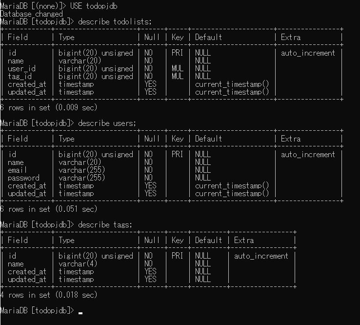
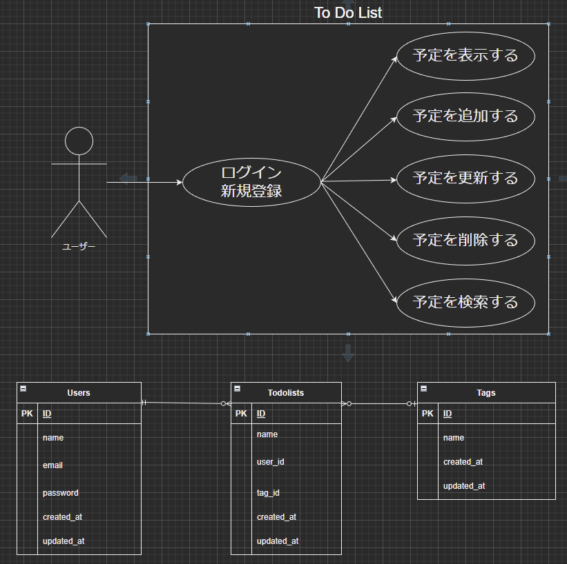

# アプリケーション名 ログイン機能付きTodoアプリ
概要説明  
ログイン機能のついたタスク管理アプリ。  
ログイン後トップページでタスクの追加・更新・削除が行える。
追加の際にはタグを指定する事でタスクが５種類に分類可能。  
タスク検索ページでは登録したタスクのキーワード検索やタグ検索が行える。  
< --  --- >

## 作成した目的
COACHTECHの演習課題

## 機能一覧
ログイン機能。  
タグを指定してのタスクの追加・更新・削除機能。  
キーワード・タグ検索機能。　　

## 使用技術（実行環境）
Laravel Framework 8.83.27

## テーブル設計
< ---  ---- >

## ER図
< ---  ---- >

## 他に記載することがあれば記述する 
 xamap, php , laravel , VScode  
## アカウントの種類（テストユーザーなど）  
テストユーザー：hideyuki iizuka